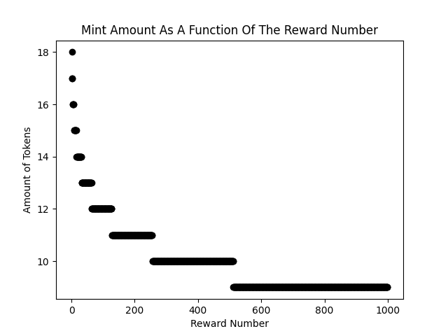

# finite-distribution

An example contract that distributes a token as a logirthmic decrease from an initial value.

Place the starter token information inside the `start_file.json` file and run `complete_build.sh`. This will auto populate the datum files required for minting. The next step is running the scripts in order inside the `scripts` folder. First, create the script reference then create the starter utxo. After that an individual mint can be ran with script 2 and a chained tx mint can be ran with script 3.

Script 3 mimics a mining of this token by tx chaining the minting process.

### The Token Distribution

In this repo, the token distribution is handled via a finite supply contract, via a lock and mint combo, incentivising early adoptors with larger rewards of the token. The reward function decreases logarithmically with each transaction, depleting in 262,144 transactions for a total of 524,286 tokens with 6 decimal precision. 



The graph above displays the first 1000 transactions for the action token reward function. It starts at 18 million tokens initially then decays to 9 million over the course of 1000 transactions. Below is a table displaying the number of tokens available in millions and the percentage of the total token distributed.

```
Num Tx    Tokens   % Distro
     1        36     0.00 %
    10       179     0.03 %
   100      1338     0.25 %
  1000     10031     1.91 %
 10000     66387    12.66 %
100000    331072    63.14 %
262144    524268   100.00 %
```

This distribution will take a long time to deplete and is an example.